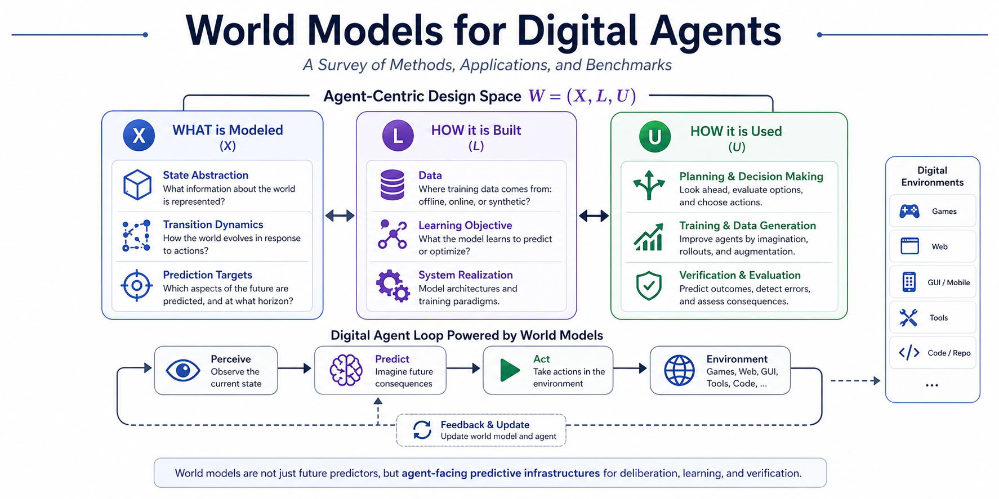

<p align="center">
  
</p>

# Awesome World Models for Digital Agents

[](https://awesome.re) [](https://arxiv.org/abs/XXXX.XXXXX) [](LICENSE) <!-- omit in toc -->

This repository accompanies [**Digital Agents Meet World Models: A Survey**](https://arxiv.org/abs/XXXX.XXXXX), providing a taxonomy-aligned bibliography of cited works and representative systems across games, web & GUI, tool-use, and code domains. The survey introduces a unified agent-centric design space **W = (X, L, U)**, organized around what is modeled, how predictive capability is built, and how world models are used inside the agent loop.

Papers are grouped by domain and listed in reverse chronological order within each subsection to support literature navigation, comparison, and ongoing updates.

## Table of Contents <!-- omit in toc -->

- [Taxonomy Overview](#taxonomy-overview)
- [Games](#games)
- [Web \& GUI](#web--gui)
- [Tool Use](#tool-use)
- [Code](#code)
- [Benchmarks \& Environments](#benchmarks--environments)
- [Datasets](#datasets)
- [Related Surveys](#related-surveys)
- [Contributing](#contributing)
- [Citation](#citation)

## Taxonomy Overview

The survey organizes world models for digital agents along a unified design space **W = (X, L, U)**:

| Dimension | Question | Key Choices |
|:----------|:---------|:------------|
| **X: Model Specification** | *What is modeled?* | State deltas, Full observations, Latent transitions, Auxiliary outcomes |
| **L: Learning & System Realization** | *How is it built?* | LLM-based, Visual generative, Latent dynamics, Code-based, Hybrid/modular |
| **U: Agent-Facing Role** | *How is it used?* | Decision-time planning, Training-time interaction, Predictive verification |

## Games

World models for game environments, including classical model-based RL, visual game generation, and text-interactive worlds.

### Latent Dynamics & Model-Based RL

+ [**DreamerV3**](https://arxiv.org/abs/2301.04104) (Nature, 2025) — RSSM + symlog loss; generalizes across 150+ diverse tasks. [[GitHub]](https://github.com/danijar/dreamerv3)
+ [**DIAMOND**](https://arxiv.org/abs/2405.12399) (NeurIPS, 2024) — U-Net diffusion transition operator for Atari. [[GitHub]](https://github.com/eloialonso/diamond)
+ [**STORM**](https://arxiv.org/abs/2310.09615) (NeurIPS, 2023) — Stochastic Transformer + VAE world model. [[GitHub]](https://github.com/weipu-zhang/STORM)
+ [**IRIS**](https://arxiv.org/abs/2209.00588) (ICLR, 2023) — VQ-VAE + Transformer autoregressive world model. [[GitHub]](https://github.com/eloialonso/iris)
+ [**EfficientZero**](https://arxiv.org/abs/2111.00210) (NeurIPS, 2021) — MuZero + self-supervised consistency; sample-efficient. [[GitHub]](https://github.com/YeWR/EfficientZero)
+ [**Dreamer**](https://arxiv.org/abs/1912.01603) (ICLR, 2020) — Latent imagination via RSSM; multi-step backpropagation. [[GitHub]](https://github.com/danijar/dreamer)
+ [**MuZero**](https://arxiv.org/abs/1911.08265) (Nature, 2020) — Value-aligned latent dynamics with MCTS; masters Go, chess, shogi, and Atari.
+ [**PlaNet (RSSM)**](https://arxiv.org/abs/1811.04551) (ICML, 2019) — Learning latent dynamics for planning from pixels. [[GitHub]](https://github.com/google-research/planet)
+ [**World Models**](https://arxiv.org/abs/1803.10122) (NeurIPS, 2018) — VAE + MDN-RNN; influential early architecture. [[GitHub]](https://github.com/hardmaru/WorldModelsExperiments)

### Visual Game Generation

+ [**GameNGen**](https://arxiv.org/abs/2408.14837) (ICLR, 2025) — U-Net diffusion runs DOOM at 20 FPS.
+ [**The Matrix**](https://arxiv.org/abs/2412.03568) (arXiv, 2024) — Infinite-horizon world generation with real-time moving control.
+ [**Oasis**](https://oasis-model.github.io) (Decart, 2024) — Transformer-based real-time interactive world generation. [[GitHub]](https://github.com/etched-ai/open-oasis)
+ [**Genie**](https://arxiv.org/abs/2402.15391) (ICML, 2024) — Latent action discovery; generative interactive environment from video.

### Text-Interactive Worlds

+ [**From Word to World**](https://arxiv.org/abs/2512.18832) (arXiv, 2025) — Evaluating LLMs as implicit text-based world models. [[GitHub]](https://github.com/X1AOX1A/Word2World)
+ [**WALL-E 2.0**](https://arxiv.org/abs/2504.15785) (arXiv, 2025) — Neuro-symbolic world alignment for text-world planning. [[GitHub]](https://github.com/elated-sawyer/WALL-E)
+ [**WALL-E 1.0**](https://arxiv.org/abs/2410.07484) (arXiv, 2024) — Rule-aligned world model for LLM agents in text environments. [[GitHub]](https://github.com/elated-sawyer/WALL-E)
+ [**RAP**](https://arxiv.org/abs/2305.14992) (EMNLP, 2023) — Reasoning with language model is planning with world model. [[GitHub]](https://github.com/Ber666/RAP)

### World Model Theory & Analysis

+ [**Neuro-Symbolic Synergy**](https://arxiv.org/abs/2602.10480) (arXiv, 2026) — Neuro-symbolic synergy for interactive world modeling. [[GitHub]](https://github.com/tianyi-lab/NeSyS)
+ [**Current Agents Fail to Leverage WM**](https://arxiv.org/abs/2601.03905) (arXiv, 2026) — Negative evidence on agents using world models as foresight tools.
+ [**General Agents Contain World Models**](https://arxiv.org/abs/2506.01622) (ICML, 2025) — Theoretical result on world models in general agents.

## Web & GUI

World models for web navigation, desktop/mobile GUI interaction, and computer-use agents.

### Web Navigation

+ [**WAC**](https://arxiv.org/abs/2602.15384) (arXiv, 2026) — World-model-augmented web agents with action correction.
+ [**WebWorld**](https://arxiv.org/abs/2602.14721) (arXiv, 2026) — Large-scale LLM-based world model for web agent training.
+ [**DynaWeb**](https://arxiv.org/abs/2601.22149) (arXiv, 2026) — Model-based reinforcement learning of web agents.
+ [**WebWM**](https://arxiv.org/abs/2512.23676) (arXiv, 2025) — Web World Models; semantic HTML delta prediction.
+ [**WebSynthesis**](https://arxiv.org/abs/2507.04370) (arXiv, 2025) — World-model-guided MCTS for efficient WebUI-trajectory synthesis. [[GitHub]](https://github.com/LucusFigoGao/WebSynthesis)
+ [**WebEvolver**](https://arxiv.org/abs/2504.21024) (arXiv, 2025) — Enhancing web agent self-improvement with coevolving world model. [[GitHub]](https://github.com/Tencent/SelfEvolvingAgent)
+ [**WebDreamer**](https://arxiv.org/abs/2411.06559) (TMLR, 2025) — LLM web state simulation + tree search for planning. [[GitHub]](https://github.com/OSU-NLP-Group/WebDreamer)
+ [**WMA Web Agent**](https://arxiv.org/abs/2410.13232) (ICLR, 2025) — Learning and leveraging environment dynamics in web navigation. [[GitHub]](https://github.com/kyle8581/WMA-Agents)

### GUI — Desktop & Computer-Use

+ [**Computer-Using World Model**](https://arxiv.org/abs/2602.17365) (arXiv, 2026) — LLM-based UI state delta prediction for action search.
+ [**SafePred**](https://arxiv.org/abs/2602.01725) (arXiv, 2026) — Predictive guardrail for computer-using agents via world models. [[GitHub]](https://github.com/YurunChen/SafePred)
+ [**R-WoM**](https://arxiv.org/abs/2510.11892) (arXiv, 2025) — Retrieval-augmented world model for computer-use agents.
+ [**NeuralOS**](https://arxiv.org/abs/2507.08800) (arXiv, 2025) — RNN + pixel diffusion for operating system simulation. [[GitHub]](https://github.com/yuntian-group/neural-os)

### GUI — Mobile

+ [**Code2World**](https://arxiv.org/abs/2602.09856) (arXiv, 2026) — GUI world model via renderable code generation. [[GitHub]](https://github.com/AMAP-ML/Code2World)
+ [**GEBench**](https://arxiv.org/abs/2602.09007) (arXiv, 2026) — Benchmarking image generation models as GUI environments. [[GitHub]](https://github.com/stepfun-ai/GEBench)
+ [**gWorld**](https://arxiv.org/abs/2602.01576) (arXiv, 2026) — Generative visual code for mobile world modeling. [[GitHub]](https://github.com/trillion-labs/gWorld)
+ [**MobileDreamer**](https://arxiv.org/abs/2601.04035) (arXiv, 2026) — Generative sketch world model for GUI agents.
+ [**MobileWorldBench**](https://arxiv.org/abs/2512.14014) (arXiv, 2025) — Towards semantic world modeling for mobile agents. [[GitHub]](https://github.com/jacklishufan/MobileWorld)
+ [**UISim**](https://arxiv.org/abs/2509.21733) (arXiv, 2025) — Interactive image-based UI simulator for dynamic mobile environments.
+ [**ViMo**](https://arxiv.org/abs/2504.13936) (arXiv, 2025) — Generative visual GUI world model for app agents.

### Cross-Domain GUI/Web

+ [**World Craft**](https://arxiv.org/abs/2601.09150) (arXiv, 2026) — Agentic framework to create visualizable worlds via text. [[GitHub]](https://github.com/HerzogFL/World-Craft)
+ [**VAGEN**](https://arxiv.org/abs/2510.16907) (arXiv, 2025) — Reinforcing world model reasoning for multi-turn VLM agents. [[GitHub]](https://github.com/mll-lab-nu/VAGEN)
+ [**SimuRA**](https://arxiv.org/abs/2507.23773) (arXiv, 2025) — World-model-driven simulative reasoning architecture for general goal-oriented agents.
+ [**EvoAgent**](https://arxiv.org/abs/2502.05907) (arXiv, 2025) — Self-evolving agent with continual world model for long-horizon tasks. [[GitHub]](https://github.com/fengtt42/EvoAgent)
+ [**WorldGPT**](https://doi.org/10.1145/3664647.3681488) (ACM MM, 2024) — Empowering LLMs as multimodal world models. [[GitHub]](https://github.com/DCDmllm/WorldGPT)

## Tool Use

World models for tool-augmented agents, API interaction, and workflow systems.

+ [**Agent World Model**](https://arxiv.org/abs/2602.10090) (arXiv, 2026) — Infinity synthetic environments for agentic RL. [[GitHub]](https://github.com/Snowflake-Labs/agent-world-model)
+ [**RWML**](https://arxiv.org/abs/2602.05842) (arXiv, 2026) — Reinforcement world model learning for LLM-based agents.
+ [**World of Workflows**](https://arxiv.org/abs/2601.22130) (arXiv, 2026) — Benchmark for bringing world models to enterprise systems. [[GitHub]](https://github.com/Skyfall-Research/world-of-workflows)
+ [**GTM**](https://arxiv.org/abs/2512.04535) (arXiv, 2025) — Simulating the world of tools for AI agents.
+ [**LLMs as Simulators**](https://arxiv.org/abs/2510.14969) (arXiv, 2025) — LLMs as scalable, general-purpose simulators for evolving digital agent training. [[GitHub]](https://github.com/WadeYin9712/UI-Simulator)
+ [**ToolRM**](https://arxiv.org/abs/2509.11963) (arXiv, 2025) — Outcome reward models for tool-calling LLMs.

## Code

World models for code generation, software engineering, and executable environment modeling.

+ [**SWE-World**](https://arxiv.org/abs/2602.03419) (arXiv, 2026) — Building software engineering agents in docker-free environments. [[GitHub]](https://github.com/RUCAIBox/SWE-World)
+ [**CWM**](https://arxiv.org/abs/2510.02387) (arXiv, 2025) — Open-weights LLM for research on code generation with world models. [[GitHub]](https://github.com/facebookresearch/cwm)
+ [**Code World Models (GIF-MCTS)**](https://arxiv.org/abs/2405.15383) (arXiv, 2024) — Generating code world models with LLMs guided by Monte Carlo tree search. [[GitHub]](https://github.com/nicoladainese96/code-world-models)
+ [**WorldCoder**](https://arxiv.org/abs/2402.12275) (NeurIPS, 2024) — Model-based LLM agent that builds world models by writing code and interacting with the environment. [[GitHub]](https://github.com/haotang1995/WorldCoder)

## Benchmarks & Environments

Representative interactive benchmarks and environments for evaluating world models in digital-agent settings, organized by domain. Descriptions highlight the primary predictive difficulty each environment introduces.

### Games

+ [**PlanCraft**](https://arxiv.org/abs/2412.21033) (arXiv, 2024) — Structured planning over branching crafting dependencies. [[GitHub]](https://github.com/gautierdag/plancraft)
+ [**Minigrid**](https://arxiv.org/abs/2306.13831) (arXiv, 2023) — Compact planning under partially observable gridworld dynamics. [[GitHub]](https://github.com/Farama-Foundation/Minigrid)
+ [**SMACv2**](https://arxiv.org/abs/2212.07489) (arXiv, 2022) — Harder stochastic branching and robust multi-agent rollout. [[GitHub]](https://github.com/oxwhirl/smacv2)
+ [**ScienceWorld**](https://arxiv.org/abs/2203.07540) (EMNLP, 2022) — Causal reasoning over structured textual world state. [[GitHub]](https://github.com/allenai/ScienceWorld)
+ [**Atari 100k**](https://arxiv.org/abs/2111.00210) (NeurIPS, 2021) — Sample-efficient rollout learning from limited data. [[GitHub]](https://github.com/YeWR/EfficientZero)
+ [**MiniHack**](https://arxiv.org/abs/2109.13202) (arXiv, 2021) — Modular long-horizon transition modeling across diverse tasks. [[GitHub]](https://github.com/NetHack-LE/minihack)
+ [**Crafter**](https://arxiv.org/abs/2109.06780) (arXiv, 2021) — Persistent survival-state dynamics and open-ended progression. [[GitHub]](https://github.com/danijar/crafter)
+ [**ALFWorld**](https://arxiv.org/abs/2010.03768) (ICLR, 2021) — Multi-step symbolic planning with delayed consequences. [[GitHub]](https://github.com/alfworld/alfworld)
+ [**NetHack**](https://arxiv.org/abs/2006.13760) (NeurIPS, 2020) — Partial observability and long-horizon symbolic-visual state tracking. [[GitHub]](https://github.com/NetHack-LE/nle)
+ [**Procgen**](https://arxiv.org/abs/1912.01588) (ICML, 2020) — Generalization under procedurally varying dynamics. [[GitHub]](https://github.com/openai/procgen)
+ [**SMAC**](https://arxiv.org/abs/1902.04043) (AAMAS, 2019) — Multi-agent state evolution and coordination-sensitive rollout. [[GitHub]](https://github.com/oxwhirl/smac)
+ [**BabyAI**](https://arxiv.org/abs/1810.08272) (ICLR, 2019) — Grounded language-conditioned planning and hidden-state tracking. [[GitHub]](https://github.com/mila-iqia/babyai)
+ [**TextWorld**](https://arxiv.org/abs/1806.11532) (CGW@IJCAI, 2018) — Long-horizon symbolic transitions and command-conditioned dynamics. [[GitHub]](https://github.com/Microsoft/TextWorld)
+ [**Atari 200M**](https://doi.org/10.1038/nature14236) (Nature, 2015) — Visual dynamics modeling under long-horizon control. [[GitHub]](https://github.com/Farama-Foundation/Arcade-Learning-Environment)

### Web & GUI

+ [**MobileWorld**](https://arxiv.org/abs/2512.19432) (arXiv, 2025) — Mobile workflows with user interaction and MCP-augmented tasks. [[GitHub]](https://github.com/Tongyi-MAI/MobileWorld)
+ [**GUI-360°**](https://arxiv.org/abs/2511.04307) (arXiv, 2025) — Comprehensive dataset and benchmark for computer-using agents. [[GitHub]](https://github.com/2020-qqtcg/GUI-360)
+ [**TheAgentCompany**](https://arxiv.org/abs/2412.14161) (arXiv, 2024) — Enterprise-style browser workflows and hidden application logic. [[GitHub]](https://github.com/TheAgentCompany/TheAgentCompany)
+ [**WindowsAgentArena**](https://arxiv.org/abs/2409.08264) (arXiv, 2024) — Real multi-app state coordination under desktop interaction. [[GitHub]](https://github.com/microsoft/WindowsAgentArena)
+ [**AndroidWorld**](https://arxiv.org/abs/2405.14573) (arXiv, 2024) — Dynamic mobile UI transitions under touch interaction. [[GitHub]](https://github.com/google-research/android_world)
+ [**OSWorld**](https://arxiv.org/abs/2404.07972) (arXiv, 2024) — Open-ended computer-use transitions across apps and OS state. [[GitHub]](https://github.com/xlang-ai/OSWorld)
+ [**OmniACT**](https://arxiv.org/abs/2402.17553) (arXiv, 2024) — Executable computer-use actions with cross-platform UI effects. [[Website]](https://huggingface.co/datasets/Writer/omniact)
+ [**VisualWebArena**](https://arxiv.org/abs/2401.13649) (arXiv, 2024) — Multimodal web-state prediction with visual-semantic grounding. [[GitHub]](https://github.com/web-arena-x/visualwebarena)
+ [**WebArena**](https://arxiv.org/abs/2307.13854) (ICLR, 2024) — Semantic UI transitions under realistic web workflows. [[GitHub]](https://github.com/web-arena-x/webarena)
+ [**WebShop**](https://arxiv.org/abs/2207.01206) (NeurIPS, 2022) — Workflow branching and latent task progress in shopping interfaces. [[GitHub]](https://github.com/princeton-nlp/WebShop)
+ [**MiniWoB++**](https://arxiv.org/abs/1802.08802) (arXiv, 2018) — Short-horizon UI changes with typed web actions. [[GitHub]](https://github.com/Farama-Foundation/miniwob-plusplus)
+ [**World of Bits**](https://proceedings.mlr.press/v70/shi17a.html) (ICML, 2017) — Open-domain web-state transitions under interface interaction.

### Tool Use

+ [**τ-Voice**](https://arxiv.org/abs/2603.13686) (arXiv, 2026) — Voice-grounded tool use with multimodal state tracking.
+ [**AgentWorldModel-1K**](https://arxiv.org/abs/2602.10090) (arXiv, 2026) — Synthetic external-state modeling in executable SQL-MCP ecosystems. [[GitHub]](https://github.com/Snowflake-Labs/agent-world-model)
+ [**World of Workflows**](https://arxiv.org/abs/2601.22130) (arXiv, 2026) — Enterprise workflow transitions with hidden service-side dependencies. [[GitHub]](https://github.com/Skyfall-Research/world-of-workflows)
+ [**MCP-Universe**](https://arxiv.org/abs/2508.14704) (arXiv, 2025) — Multi-server tool coordination and external-state mutation. [[GitHub]](https://github.com/SalesforceAIResearch/MCP-Universe)
+ [**τ²-bench**](https://arxiv.org/abs/2506.07982) (arXiv, 2025) — Multi-party control and persistent tool-state consistency. [[GitHub]](https://github.com/sierra-research/tau2-bench)
+ [**BFCL v3**](https://gorilla.cs.berkeley.edu/blogs/13_bfcl_v3_multi_turn.html) (ICML, 2025) — Multi-turn function-call validity and argument correctness. [[GitHub]](https://github.com/ShishirPatil/gorilla)
+ [**τ-bench**](https://arxiv.org/abs/2406.12045) (arXiv, 2024) — Typed tool-state updates in tool-agent-user interaction. [[GitHub]](https://github.com/sierra-research/tau-bench)

### Code

+ [**SWE-World**](https://arxiv.org/abs/2602.03419) (arXiv, 2026) — Software-engineering transitions with surrogate environment feedback. [[GitHub]](https://github.com/RUCAIBox/SWE-World)
+ [**SWE-bench**](https://arxiv.org/abs/2310.06770) (ICLR, 2024) — Repository-scale state evolution under code edits and tests. [[GitHub]](https://github.com/swe-bench/SWE-bench)
+ [**SWE-bench Verified**](https://arxiv.org/abs/2310.06770) (ICLR, 2024) — Verified long-horizon software issue resolution with execution feedback. [[GitHub]](https://github.com/swe-bench/SWE-bench)
+ [**InterCode**](https://arxiv.org/abs/2306.14898) (arXiv, 2023) — Interactive coding dynamics with stepwise execution feedback. [[GitHub]](https://github.com/princeton-nlp/intercode)
+ [**HumanEval**](https://arxiv.org/abs/2107.03374) (arXiv, 2021) — Executable outcome prediction for code generation. [[GitHub]](https://github.com/openai/human-eval)

### Multi-Domain

+ [**AgentGym**](https://arxiv.org/abs/2406.04151) (arXiv, 2024) — Transfer of predictive abstractions across heterogeneous environments. [[GitHub]](https://github.com/WooooDyy/AgentGym)
+ [**AgentBench**](https://arxiv.org/abs/2308.03688) (arXiv, 2023) — Cross-domain comparison of agent behavior and predictive utility. [[GitHub]](https://github.com/THUDM/AgentBench)

## Datasets

Datasets used to train and evaluate digital-agent world models, organized by supervision type and the role each category plays in the learning pipeline.

| Supervision Type | Representative Datasets | Role in World Models |
|:-----------------|:-----------------------|:---------------------|
| **Action-conditioned transitions** | [Mind2Web](https://arxiv.org/abs/2306.06070), [Android in the Wild](https://arxiv.org/abs/2307.10088), [Android Control](https://arxiv.org/abs/2406.03679), [MobileWorldBench](https://arxiv.org/abs/2512.14014) | Semantic UI dynamics, DOM/screenshot deltas, action-conditioned next-state prediction |
| **Trajectory demonstrations and behavioral priors** | [GUI-360°](https://arxiv.org/abs/2511.04307), [WebLINX](https://arxiv.org/abs/2402.05930), [AMEX](https://arxiv.org/abs/2407.17490), [Atari-HEAD](https://arxiv.org/abs/1903.06754), [MineRL](https://arxiv.org/abs/1907.13440), [VPT](https://arxiv.org/abs/2206.11795), [TextWorld](https://arxiv.org/abs/1806.11532), [ALFWorld](https://arxiv.org/abs/2010.03768), [ScienceWorld](https://arxiv.org/abs/2203.07540) | Planning priors, long-range workflow structure, reducing long-horizon compounding error |
| **Execution-grounded supervision** | [APPS](https://arxiv.org/abs/2105.09938), [MBPP](https://arxiv.org/abs/2108.07732), [CodeXGLUE](https://arxiv.org/abs/2102.04664), [HumanEval](https://arxiv.org/abs/2107.03374) | Constraint-aware prediction, execution-grounded transition modeling, code-world semantics |
| **Tool interaction traces** | [ToolBench](https://arxiv.org/abs/2307.16789), [ToolAlpaca](https://arxiv.org/abs/2306.05301), [API-Bank](https://arxiv.org/abs/2304.08244) | Schema-constrained actions, external system dynamics, multi-step tool workflows |
| **Large-scale priors and foundation corpora** | [The Stack](https://arxiv.org/abs/2211.15533), [StarCoder Data](https://arxiv.org/abs/2305.06161) | Reusable semantic priors, representation quality, cross-domain generalization |
| **Synthetic and simulated trajectories** | [WebWorld](https://arxiv.org/abs/2602.14721), [Agent World Model](https://arxiv.org/abs/2602.10090) | Expanding branching coverage, surfacing rare or risky states, planning robustness |

## Related Surveys

Surveys on world models, autonomous agents, and related topics that provide complementary perspectives to our work.

+ [**Agentic World Modeling: Foundations, Capabilities, Laws, and Beyond**](https://arxiv.org/abs/2604.22748) (arXiv, 2026)
+ [**Learning to Model the World: A Survey of World Models in Artificial Intelligence**](https://www.preprints.org/manuscript/202603.0739) (Preprints, 2026)
+ [**Towards Generalist Embodied AI: A Survey on World Models for VLA Agents**](https://www.techrxiv.org/doi/10.36227/techrxiv.176948355.54623875) (TechRxiv, 2026)
+ [**A Step Toward World Models: A Survey on Robotic Manipulation**](https://arxiv.org/abs/2511.02097) (arXiv, 2025)
+ [**From Masks to Worlds: A Hitchhiker's Guide to World Models**](https://arxiv.org/abs/2510.20668) (arXiv, 2025)
+ [**A Comprehensive Survey on World Models for Embodied AI**](https://arxiv.org/abs/2510.16732) (arXiv, 2025)
+ [**3D and 4D World Modeling: A Survey**](https://arxiv.org/abs/2509.07996) (arXiv, 2025)
+ [**A Survey: Learning Embodied Intelligence from Physical Simulators and World Models**](https://arxiv.org/abs/2507.00917) (arXiv, 2025)
+ [**The Role of World Models in Shaping Autonomous Driving: A Comprehensive Survey**](https://arxiv.org/abs/2502.10498) (arXiv, 2025)
+ [**A Survey of World Models for Autonomous Driving**](https://arxiv.org/abs/2501.11260) (arXiv, 2025)
+ [**Understanding World or Predicting Future? A Comprehensive Survey of World Models**](https://arxiv.org/abs/2411.14499) (ACM CSUR, 2025)
+ [**Is Sora a World Simulator? A Comprehensive Survey on General World Models and Beyond**](https://arxiv.org/abs/2405.03520) (arXiv, 2024)
+ [**A Survey on Large Language Model Based Autonomous Agents**](https://arxiv.org/abs/2308.11432) (Frontiers, 2023)

## Contributing

**We welcome contributions!** This project is actively maintained. If you know a paper or benchmark that should be listed, please [open an issue](https://github.com/Darwin-Agent/awesome-world-models-for-digital-agents/issues/new?template=add_paper.yml) or submit a pull request.

When submitting, please include:
- **Title** and **paper URL** (arXiv or publication link)
- **Venue** and **year**
- **Target section** (Games / Web & GUI / Tool Use / Code / Benchmarks)
- **One-line summary** of the contribution
- **Code URL** (optional, for GitHub link)

## Citation

If you find this resource useful, please cite our survey:

```bibtex
@article{survey2026digitalagentsworldmodels,
  title         = {Digital Agents Meet World Models: A Survey},
  author        = {AI Agent Team},
  year          = {2026},
  eprint        = {XXXX.XXXXX},
  archivePrefix = {arXiv},
  primaryClass  = {cs.AI},
  url           = {https://arxiv.org/abs/XXXX.XXXXX}
}
```